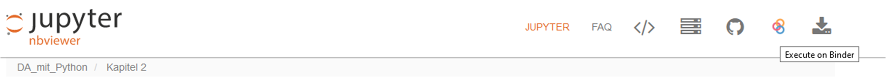

# Datenanalyse mit Python

### Inhaltsübersicht

Kapitel 1: Grundlagen... (kommt noch)

#### Schwerpunkt: Pandas

[Kapitel 2: Dataframe erstellen und speichern](https://nbviewer.jupyter.org/github/manfred2020/DA_mit_Python/blob/main/Kapitel%202/2_Dataframe%20erstellen%20und%20speichern.ipynb)

[Kapitel 3: Fehlende Werte, Werte außerhalb des Skalenbereichs, Zeilenduplikate](https://nbviewer.jupyter.org/github/manfred2020/DA_mit_Python/blob/main/Kapitel%203/3_Fehlende%20Werte_Werte%20au%C3%9Ferhalb%20des%20Skalenbereichs_Zeilenduplikate.ipynb)

[Kapitel 4: Daten laden und Dataframe Basisinfos](https://nbviewer.jupyter.org/github/manfred2020/DA_mit_Python/blob/main/Kapitel%204/4_Daten%20laden%20und%20Dataframe%20Basisinfos.ipynb)

[Kapitel 5: Deskriptive Analyse](https://nbviewer.jupyter.org/github/manfred2020/DA_mit_Python/blob/main/Kapitel%205/5_Deskriptive%20Analyse.ipynb)

Kapitel 6: Daten gruppieren, sortieren, filtern

Kapitel 7: Kreuztabellierung

Kapitel 8: Variablen umkodieren

Kapitel 9: Variablen berechnen

Kapitel 10: Variablen bzw. Dataframes transformieren

Kapitel 11: Einfach grafische Datenanalyse

Kapitel 12: Mehrfachantwortensets

#### Schwerpunkt: Spezifische Module zur statistischen Datenanalyse und Visualierung

Kapitel 13: ...

 

Weitere Kapitel (in Summe wohl 21) werden folgen. Ev. ein Kapitel pro Woche oder so... Die meisten Kapitel sind fertig, bedürfen jedoch noch einer Durchsicht und Überprüfung, bevor sie hochgeladen werden.

Die einzelnen Kapitel liegen als **Jupyter Notebooks** vor und werden mit **nbviewer** im Browser angezeigt (die Links am besten in neuem Tab öffnen). Bis eine hier auf GitHub aktualisierte Version eines Notebooks im nbviewer korrekt angezeigt wird, können einige Stunden vergehen.

Neben dieser Ansicht der Notebooks wird es künftig auch möglich sein, die Notebooks interaktiv über den Browser durchzuarbeiten. Dazu dann einfach in der nbviewer Ansicht rechts oben auf das *Execute on Binder* Symbol (die drei roten Ringe) klicken (vgl. folgenden Screenshot aus Firefox).

 
 

### Hintergrundinfo
Im Jahr 2019 habe ich wiedermal damit begonnen, mich mit Python zu befassen. Diesmal aber nicht - wie 10 Jahre zuvor schon mal - zum Zweck der Programmierung, sondern zum Zweck der Datenvisualisierung, in weiterer Folge dann auch der Datenbearbeitung und statistischen Datenanalyse.

So entstanden im Lauf der Zeit zahlreiche Codezeilen, Scripts, Vorlagen für div. Grafiken bzw. Analysen - irgendwann dachte ich, daraus ließe sich wohl eine Art Skriptum machen. Vor allem natürlich als Nachschlagewerk für mich selbst - im Gegensatz zu gebräuchlicher Statistiksoftware wie SPSS (da gibt's Literatur zu Hauf) oder R (auch da gibt's mittlerweile so einiges) findet sich zur (sozialwissenschaftlichen) Datenanalyse mit Python nämlich noch nicht viel.

Das Skriptum nimmt langsam aber sicher Form an. Hier auf Github finden sich Jupyter Notebooks zu den einzelnen Kapiteln des Skriptums (inkl. fallweise nötiger Datenfiles oder sonstiger Dateien). Das Skriptum selbst wird daneben als PDF zusammengestellt und zu gegebener Zeit online gestellt.

WICHTIG: All das hier ist kein Programmierkurs bzw. keine umfangreiche Einführung in Python. Ziel ist, div. Module von Python (bspw. Pandas, Statsmodels, Matplotlib, Seaborn und viele weitere) vorzustellen, die sich mit Datenbearbeitung, statistischer Datenanalyse und Visualisierung befassen. Auch wird - vorerst - nicht auf Aspekte es Machine Learnings oder Deep Learnings (hier bietet Python einiges) eingegangen; behandelt werden vielmehr typische sozialwissenschaftliche Verfahren, wie man sie aus den üblichen Statistikprogrammen kennt (Korrelation, T-Tests, Regression, Varianzanalysen, usw.). Auch die grafische Datenanalyse bzw. die Visualisierung von Daten wird eine zentrale Rolle spielen. Hier bietet Python Vorteile bspw. gegenüber SPSS und steht R in nichts nach. Begonnen wird aber natürlich mit dem Import von Daten, der Datenbearbeitung, deskriptiven Auswertungen usw. Sämliche Jupyter Notebooks hier werden von Zeit zu Zeit überarbeitet, d.h. ev. an aktuelle Versionen der Python Module angepasst, mit neuen Beispielen und/oder besseren Erklärungstexten versehen, um neue Funktionen erweitert, usw.

 

Feedback jederzeit möglich!

 
 

**Question:** *Why is all this in german?* 

**Answer:** *Because there's enough literature, enough code, enough manuals, etc. in english about data analysis and data visualisation with python available. Not so in german.*

 
 

<a property="dct:title" rel="cc:attributionURL" href="https://github.com/manfred2020/DA_mit_Python">Datenanalyse mit Python</a> by <a rel="cc:attributionURL dct:creator" property="cc:attributionName" href="https://github.com/manfred2020">Manfred Hammerl</a> is licensed under <a href="http://creativecommons.org/licenses/by-nc/4.0/?ref=chooser-v1" target="_blank" rel="license noopener noreferrer" style="display:inline-block;">CC BY-NC 4.0</a>

